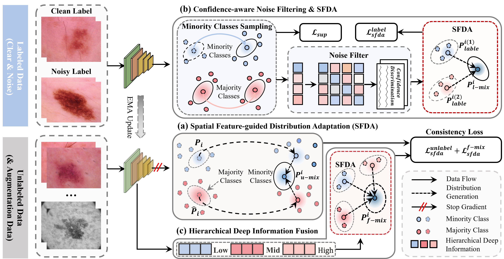

# SFDA-NIL: Noisy Imbalance Learning in Medical Imaging with Spatial Feature-Guided Distribution Adaptation
<!-- PROJECT SHIELDS -->

<!-- PROJECT LOGO -->
 

## Main Figure

  

  <h3 align="center">SFDA-NIL</h3>
  

    SFDA-NIL: Noisy Imbalance Learning in Medical Imaging with Spatial Feature-Guided Distribution Adaptation
     
<!--     <a href=""><strong>EXPLORE THE DOCUMENTATION FOR THIS PROJECT »</strong></a> -->
     
     
<!--     <a href="https://github.com/shaojintian/Best_README_template">查看Demo</a> -->
    ·
<!--     <a href="https://github.com/shaojintian/Best_README_template/issues">报告Bug</a>
    ·
    <a href="https://github.com/shaojintian/Best_README_template/issues">提出新特性</a> -->
  

【Abstract】
Medical imaging datasets often suffer from severe class imbalance and noisy labels. Although numerous studies have proposed solutions to these issues individually, simultaneously addressing both challenges remains highly difficult. To address these challenges, we propose a novel semi-supervised learning method, named Spatial Feature-guided Distribution Adaptation for Noisy Imbalanced Learning (SFDA-NIL). First, we design a Spatial Feature-guided Distribution Adaptation (SFDA) module to adaptively reshape the prediction distribution in the feature space, significantly enhancing the representation of minority classes. The module alleviates the tendency of decision boundaries to shift into low-density regions under imbalanced learning. Second, we propose a confidence-based noise filtering mechanism integrated with SFDA to dynamically assess prediction reliability and selectively correct noisy samples. The mechanism effectively suppresses the propagation of noisy labels while avoiding unjust penalties on hard-to-discriminate minority classes. Third, we develop a hierarchical deep feature fusion strategy that incorporates rich spatial information to preserve feature details and leverages spatial features to guide the construction of a robust feature distribution. Extensive experiments on multiple medical imaging benchmark datasets validate the effectiveness of our approach. Results demonstrate that SFDA-NIL significantly improves sensitivity to minority classes and overall robustness under varying noise levels and class imbalance conditions.

